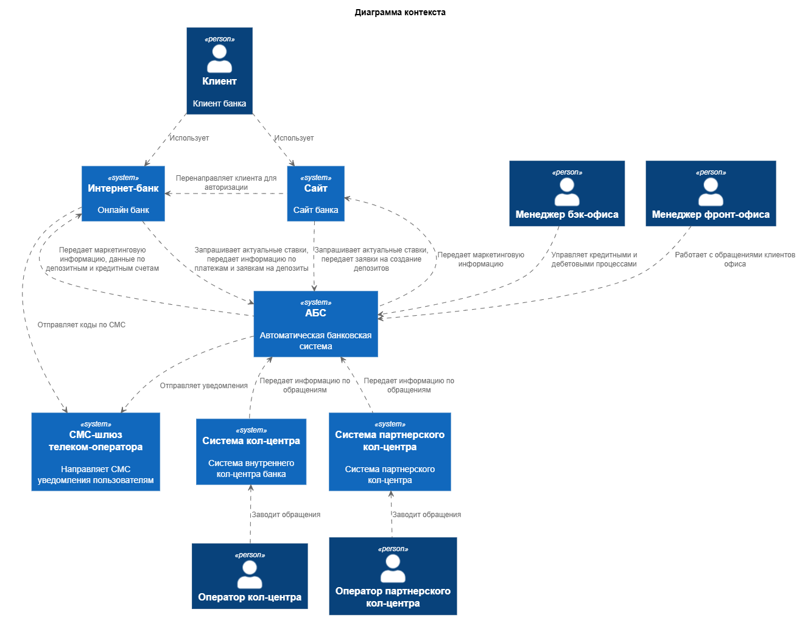
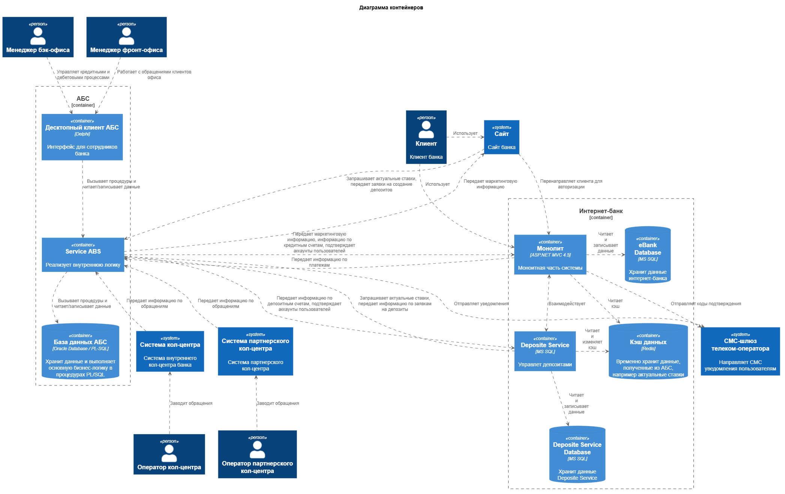

### **Название задачи: Реализация функционала подачи заявок на открытие депозитов и накопительных счетов** 
### **Автор: PAKETIKk**
### **Дата: 30.09.26**
### **Функциональные требования**

|**№**|**Действующие лица или системы**|**Use Case**|**Описание**|
| :-: | :- | :- | :- |
| UC1 | Клиент   Сайт   Интернет-банк   СМС-шлюз | Регистрация | 1. клиент открывает сайт банка   2. Клиент нажимает кнопку "Регистрация"   3. Сайт перенаправляет клиента на страницу регистрации в интернет-банк   4. Клиент вводит номер телефона, ФИО и пароль в поле ввода пароля и поле подтверждения пароля   5. Интернет-банк запрашивает подтверждение по коду из СМС и отправляет его через СМС-шлюз   6. Клиент вводит код из СМС   7. Интернет-банк сохраняет данные пользователя и хэш пароля в БД, ставит значение поля "Подтвержденный пользователь" false   8. Интернет-банк перенаправляет клиента на страницу входа |
| UC2 | Клиент   Сайт   Интернет-банк   СМС-шлюз | Авторизация | 1. Клиент открывает на сайт банка   2. Клиент нажимает кнопку авторизации   3. Сайт перенаправляет клиента на страницу входа в интернет-банк   4. Клиент вводит данные профиля интернет-банка   5. Интернет-банк запрашивает подтверждение по коду из СМС и отправляет его через СМС-шлюз   6. Клиент вводит код из СМС   7. Интернет-банк отображает главную страницу |
| UC3 | Клиент   Сотрудник фронт-офиса   Интернет-банк   АБС   СМС-шлюз | Подтверждение аккаунта   клиента | 1. Клиент обращается к сотруднику фронт-офиса для подтверждения аккаунта   2. Сотрудник фронт-офиса проверяет документы клиента   3. Сотрудник фронт-офиса подтверждает в АБС аккаунт клиента   4. АБС направляет подтверждение в интернет-банк   5. Интернет-банк вносит информацию в БД   6. АБС отправляет уведомление по СМС |
| UC4 | Клиент   Интернет-банк   СМС-шлюз | Смена пароля | 1. Клиент с главной страницы переходит в свой профиль   2. Клиент нажимает кнопку смены пароля   3. Клиент вводит новый пароль в соответствующее поле, а также в поле подтверждения пароля   4. Интернет-банк запрашивает подтверждение по коду из СМС и отправляет его через СМС-шлюз   5. Клиент вводит код из СМС   6. Интернет-банк обновляет хэш пароля в БД |
| UC5 | Клиент   Интернет-банк   АБС   СМС-шлюз | Подача заявки на открытие   депозита в Интернет-банке | 1. Клиент переходит с главной страницы интернет-банка в продукты банка   2. Интернет-банк обращается в кэш для получения текущих ставок по депозитам   3. Интернет-банк обращается в БД для получения персонализированных ставок   4. Интернет-банк отображает пользователю список депозитов с актуальными и персонализированными ставками   5. Клиент выбирает депозит из списка, указывает счет и сумму депозита и подает заявку   6. Интернет-банк запрашивает подтверждение по коду из СМС и отправляет его через СМС-шлюз   7. Клиент вводит код из СМС и подтверждает заявку   8. Интернет-банк отправляет заявку в АБС |
| UC6 | Интернет-банк   АБС | Получение актуальных   ставок по депозитам | 1. Интернет-банк отправляет запрос на получение актуальных ставок   2. АБС обращается в БД для получения ставок   3. АБС формирует и направляет ответ   4. Интернет-банк обновляет данныые ставок в кэше |
| UC7 | Сотрудник бэк-офиса   АБС   Интернет-банк   СМС-шлюз | Рассмотрение заявки   на открытие депозита | 1. Сотрудник открывает в АБС заявку   2. Сотрудник сверяет данные с текущими ставками, оценивает риски банка   3. Сотрудник подтверждает заявку в АБС   4. АБС направляет подтверждение в Интернет-банк   5. Интернет-банк сохраняет информацию в БД   6. АБС направляет уведомление клиенту по СМС |

### **Нефункциональные требования**
Опишите здесь нефункциональные требования и архитектурно значимые требования.

|**№**|**Требование**|
| :-: | :- |
| **U**   | **Удобство использования (Usability)** |
| U1  | Дизайн сайта и интернет-банка должны придерживаться системы дизайна приложений банка (цвета, брендированные элементы...) | |
| U2  | Интерфейс сайта должен иметь дополнительную версию для слабовидящих | Т.к. основная клиентская база банка - люди старшего возраста, это поможет им перейти на онлайн взаимодействие с банком |
| U3  | Сайт и интернет-банк должны содержать раздел со справочной информацией по работе с системой |
| **R**   | **Надёжность (Reliability)**           |
| R1  | На этапе MVP время простоя интернет-банка может быть не более одного дня | В дальнейшем требование будет ужесточено |
| R2  | Время работы 24/7 |
| R3  | Доступность 99,9% |
| R4  | При возникновении ошибок система должна переключатсья на резервный ЦОД | В дальнейшем следует использовать оба с распределением нагрузки |
| R5  | При использовании функционала кэширования, срок хранения кэша должен быть 30 мин | Следует уточнить с командой АБС и менеджерами бэк-офиса |
| **P**   | **Производительность (Performance)**   |
| P1  | Время отклика ≤ 200 мс             | Команда АБС просит избежать прямой работы с API АБС. На этапе MVP можно кэшировать данные по ставкам в системе, но сообщать пользователю об уточнении ставки на этапе оформления заявки |
| P2  | На этапе MVP система должна поддерживать 250 одновременных пользователей |        
| **S**   | **Поддерживаемость (Supportability)**  |
| S1  | Должна быть поддержка интеграционного тестирования |
| S2  | Должны быть настроены системы мониторинга и логирования |
| S3  | Должно быть настроено автоматическое тестирование при развертывании |
| S4  | Должно быть настроено автоматические уведомления о сбоях и проблемах в системе |
| S5  | Развертывание нового функционала должно быть реализовано канареечным способом |
| **+R**  | **+ Ограничения (Restrictions)**       |
| R1  | Данные с сайта и интернет-банка должны передаваться в зашифрованном виде |
| R2  | Пароли пользователей должны храниться в виде хэша |
| R3  | Желательно использование технологий из числа имеющихся компетенций команды разработки |
| R4  | Новые технологии должны быть совместимы с имеющимся стеком |
| R5  | При внедрении Kafka доработка системы должна осуществляться по паттерну strangler fig |
| R6  | Система должна использовать кэш; кэш должен поддерживать совместную работу экземпляров приложения | 

### **Решение**

[Context diagram](./diagrams/context.puml)

  
Изображение

 

[Container diagram](./diagrams/container.puml)

  
Изображение

 

1. Т.к. в данный момент Интернет-банк представляет из себя монолитное решение, а в дальнейшем требуется развитие и масштабирование системы на большое число людей, было принято решение начать развитие системы с использованием паттерна Strangler Fig.

2. На этапе MVP будет выделен один сервис Deposite Service для управления депозитами клиентов. В дальнейшем планируется постепенное выделение сревисов из монолита и переход на микросервисную архитектуру.

3. Ввиду опасений IT команды, отвечающей за поддержание АБС, по поводу перегруженности системы было решено использовать функционал кэширования данных для избегания частого обращения в систему для получения актуальных ставок по депозитам. В качестве решения подходит Redis, т.к. он совместим со стеком имеющегося монолита, является опенсорсным решением

4. Также следует перенести хранение актуальных ставок в АБС, т.к. это позволит всем заинтересованным лицам иметь общий доступ к данным из одного места, а также позволит передавать данные в Интернет-банк.

### **Альтернативы**

1. Интернет банк: 
1.1. Оставить монолит. Это плохое решение, т.к. в любом случае планируется развитие и масштабирование системы, что крайне тяжело осуществить с монолитом. На данном этапе есть возможность начать выделять микросервисы по мере их разработки. При оставлении монолита придется в дальнейшем придется совершать дополнительную итерацию выделения микросервиса  
2. Актуальные ставки 
2.1. Оставить хранение в XLS файлах 
Решение не подходит, т.к. для хорошего пользовательского опыта и полноценного прохождения всех шагов составления заявки на открытие депозита клиенту требуется видеть актуальные ставки при подаче заявки. Вдобавок это не позволит менеджерам банка иметь актуальный, своевременный доступ к этим данным из одного места  
2.2. Перенести хранение в АБС, но не передавать ставки 
Аналогично прошлому пункту, но уже есть польза для менеджеров. Кэширование решает проблему избыточной нагрузки на АБС.  
3. Кэш 
3.1. Использование MemoryCache.  
Не подходит, т.к. у каждого экзмепляра появляется свой кэщ => увеличение нагрузки на АБС  
3.2. MS SQL Server 
Хорошо - использование уже имеющегося стека. Плохо - хуже специализированного кэша  
3.3. Другие специализированные решения 
Не столь популярны или имеют меньший функционал. Также требуют внедрения новых технологий в стек  
4. Асинхронное взаимодействие 
На этапе MVP нет большой необходимости во внедрении Kafka или аналогов, т.к. это потребует внедрения новой технологии, а при наличии всего одного микросервиса затраты на внедрение пока что не целесообразны

**Недостатки, ограничения, риски**

1. Требуется внедрение новых технологий в имеющийся стек
2. Нагрузка на АБС повысится
3. Усложнение управления ввиду выделения микросервиса
4. Более сложная разработка
5. Увеличение бюджета на разработку из-за разделения монолита
6. Использование кэша снизит потенциальную нагрузку, но может содержать неактуальные данные в период жизни кэша
7. Потребуются дополнительные тестирование и мониторинг системы
8. Возможно потребуется изменения в ядре АБС для внедрения функционала ведения ставок в системе