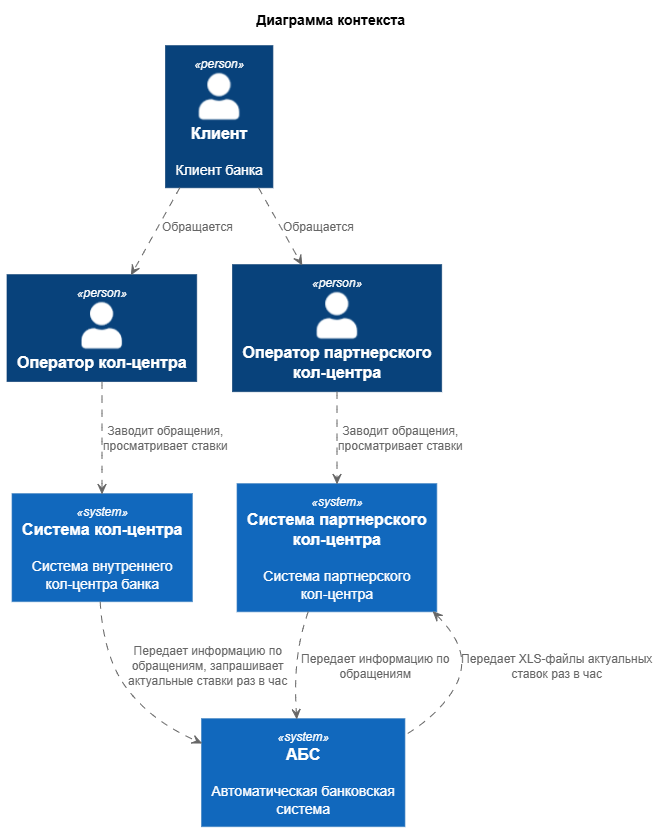
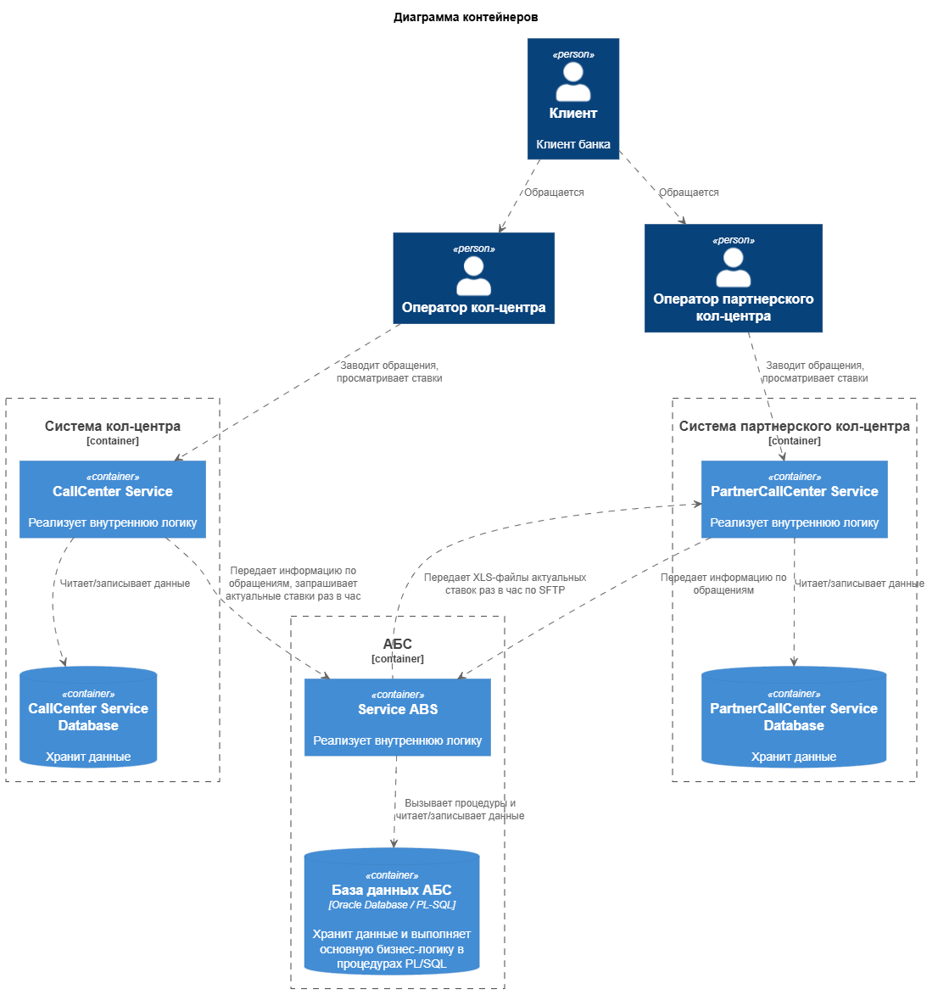

### **Название задачи: Передача актуальных ставок по депозитам в кол-центры** 
### **Автор: PAKETIKk**
### **Дата: 30.09.26**
### **Функциональные требования**
Опишите здесь верхнеуровневые Use Cases. Их нужно оформить в виде таблицы с пошаговым описанием:

|**№**|**Действующие лица или системы**|**Use Case**|**Описание**|
| :-: | :- | :- | :- |
| UC1 | Система кол-центра банка   АБС | Получение актуальных ставок | 1. Система кол-центра отправляет запрос на получение ставок   2. АБС принимает запрос, формирует и направляет ответ   3. Система кол-центра принимает ответ АБС и сохраняет в БД или кэш |
| UC2 | Система партнерского кол-центра банка   АБС | Получение актуальных ставок | 1. Наступает момент отправки данных в партнерскую систему   2. АБС формирует из имеющихся данных XLS-файл с актуальными ставками   3. АБС направляет сформированные файлы в партнерскую систему по SFTP-протоколу   4. Партнерская система сохраняет данные в БД или кэш |
| UC3 | Сотрудник кол-центра банка   Система кол-центра банка | Просмотр актуальных ставок | 1. Сотрудник в интерфейсе системы открывает страницу с текущими ставками   2. Система загружает данные из кэша или БД и отображает на странице вместе с временем актуальности данных |
| UC4 | Сотрудник партнерского кол-центра   Система партнерского кол-центра | Просмотр актуальных ставок | 1. Сотрудник в интерфейсе системы открывает страницу с текущими ставками   2. Система загружает данные из кэша или БД и отображает на странице вместе с временем актуальности данных |

### **Нефункциональные требования**
Опишите здесь нефункциональные требования и архитектурно значимые требования.

|**№**|**Требование**|
| :-: | :- |
| 1 | АБС должна направлять данные по ставкам в партнерский кол-центр каждый час |
| 2 | При использовании кэша время хранения данных должно быть бессрочным на случай сбоя в АБС |
| 3 | В кэше или БД рядом с данными по ставкам должны храниться временные метки актуальности данных |
| 4 | Вместе с данными по ставкам сотрудникам должно отображаться время актуальности данных |
| 5 | Период формирования и отправки XLS-файлов должен составлять 1 час |
| 6 | XLS-файлы передаются по SMTP-протоколу |
| 7 | Кол-центр банка должен запрашивать новые данные каждый час |

### **Решение**

[Context diagram](./diagrams/context.puml)

  
Изображение

 

[Container diagram](./diagrams/container.puml)

  
Изображение

 

Т.к. АБС и система кол-центра банка находятся в одном контуре самым простым вариантом передачи актуальных ставок является вариант запроса из системы кол-центра в АБС по http. Но из-за опасений команды АБС по нагрузке системы в прошлом следует настроить периодический опрос АБС. Также ввиду возможного изменения ставок в период между запросами следует выводить время актуальности данных для сотрудников.

Из-за нахождения системы партнерского кол-центра и АБС в разных контурах отсутствует возможность прямого обращения, но система партнера готова рпинимать XLS-файлы по SMTP-соединению. Аналогично внутренней системе данные будут формироваться и передаваться раз в час. Так как уже в плане разработка решения по задаче [Реализация функционала подачи заявок на открытие депозитов и накопительных счетов](../Task3/ADR.md) данные уже будут храниться в АБС и можно будет запускать формирование файлов на их основе.

### **Альтернативы**

**Запрашивать ставки в АБС при каждом обращении сотрудника**

Вариант не подходит из-за возрастающей нагрузки на API АБС

**Отправлять данные в кол-центр банка из АБС, а не наоборот**

Следует проконсультироваться с разработчиками

**Отправлять данные в кол-центр банка XLS-файлом**

Следует проконсультироваться с разработчиками

**Недостатки, ограничения, риски**

1. Рост нагрузки на АБС
2. Актуальность данных обновляется раз в час
3. Может потребоваться доработка ядра АБС
4. Передача данных по SMTP сама по себе не имеет встроенных механизмов защиты
5. При ошибке в передаче актуальность данных устаревает